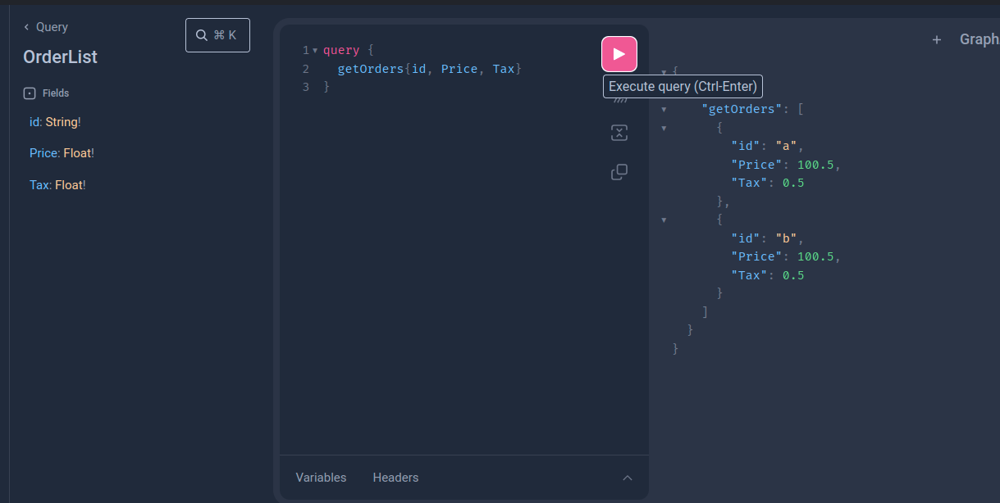

### 🚀 Guia de Configuração Rápida 🚀

**ℹ️ Instruções Gerais:**
- Para subir os periféricos, execute o comando: `docker-compose up -d`
- Para subir a aplicação, é necessário rodar o comando: `go run main.go`

**🌐 Portas de Acesso:**
- **HTTP:** 8000
- **gRPC:** 50051
- **GraphQL:** 8080

**🔍 Como Realizar Buscas:**
- **No Web Server (HTTP):**
  Execute o **COMANDO 2** do arquivo `order.http`.

- **No gRPC Server:**
  Execute o **COMANDO 3** do arquivo `order.http`.

- **No GraphQL Server:**
  Acesse o playground e execute a query conforme a imagem abaixo:

